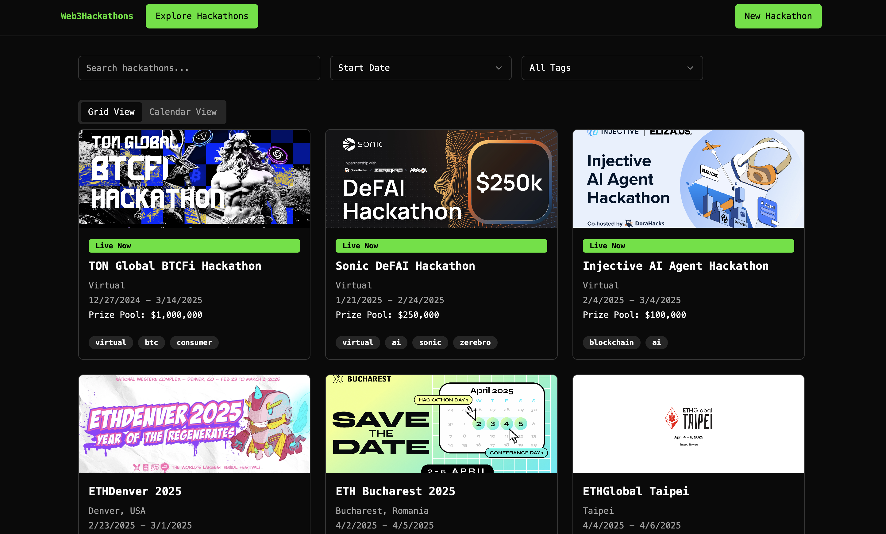

# [Web3Hackathons](https://web3hackathons.xyz)

The one stop for all the Web3 Hackathons. [Give it a go!](https://web3hackathons.xyz)

## Preview

| | |
|--|--|
|| |

## Features

- View all Web3Hackathons
  - Card View
  - Calendar View
  - Table View (⬇️)
- Submit Requests for Web3Hackathons
- Track all projects and winnings
- Submit Feature Requests (⬇️)
- Login to Track your Hackathons (⬇️)
  - Wallet
  - Gmail

## Clone and run locally

Message [wr1159](http://t.me/wr1159) on telegram if you are interested in having access to the database.

1. You'll first need your own Supabase project which can be made [via the Supabase dashboard](https://database.new)

2. Create a Table with the following SQL Command

    ```sql
    CREATE TABLE hackathons (
        id UUID DEFAULT gen_random_uuid() PRIMARY KEY, -- Unique identifier for each hackathon
        name TEXT NOT NULL,                            -- Name of the hackathon
        location TEXT,                                 -- Location of the hackathon
        start_date DATE,                               -- Start date of the hackathon
        end_date DATE,                                 -- End date of the hackathon
        prize_pool NUMERIC,                            -- Prize pool amount
        website_url TEXT,                              -- URL for more details
        tags TEXT[] DEFAULT ARRAY[]::TEXT[],           -- Tags for categorization (e.g., ["onsite", "virtual"])
        banner_image TEXT,                             -- URL for the banner image
        platform TEXT,                                 -- Platform used by the hackathon (e.g., "ETHGlobal")
        slug TEXT NOT NULL UNIQUE,                     -- Slug URL to identify the hackathon page 
        display BOOLEAN DEFAULT FALSE NOT NULL,        -- Whether the hackathon is visible publicly
        created_at TIMESTAMP DEFAULT now(),            -- Timestamp of creation
        updated_at TIMESTAMP DEFAULT now()             -- Timestamp of the last update
    );
    ```

3. Clone the Web3Hackathons repository and Install the packages

  `git clone git@github.com:wr1159/web3hackathons.git && yarn install`
4. Rename `.env.example` to `.env.local` and update the following:

  ```env
    NEXT_PUBLIC_SUPABASE_URL=[INSERT SUPABASE PROJECT URL]
    NEXT_PUBLIC_SUPABASE_ANON_KEY=[INSERT SUPABASE PROJECT API ANON KEY]
    NEXT_PUBLIC_SUPABASE_ANON_KEY=[INSERT SUPABASE PROJECT API ANON KEY]
  ```

  Both `NEXT_PUBLIC_SUPABASE_URL` and `NEXT_PUBLIC_SUPABASE_ANON_KEY` can be found in [your Supabase project's API settings](https://app.supabase.com/project/_/settings/api)
  5. You can now run the Next.js local development server:

  ```bash
    yarn dev
  ```

  The website should now be running on [localhost:3000](http://localhost:3000/).

> Check out [the docs for Local Development](https://supabase.com/docs/guides/getting-started/local-development) to also run Supabase locally.
